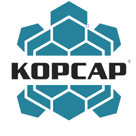
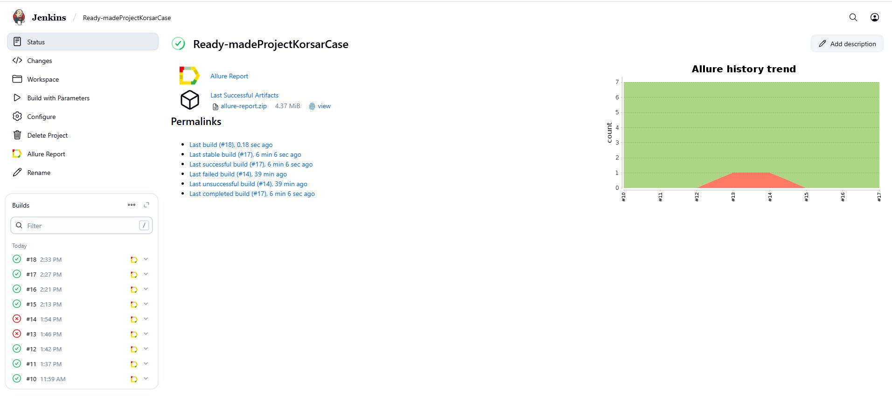
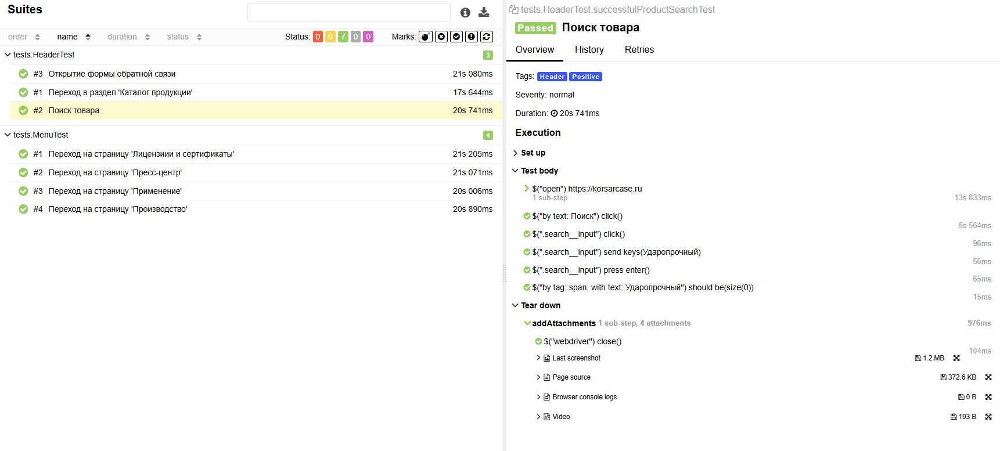
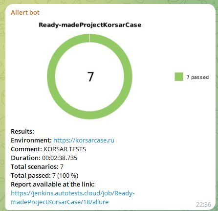
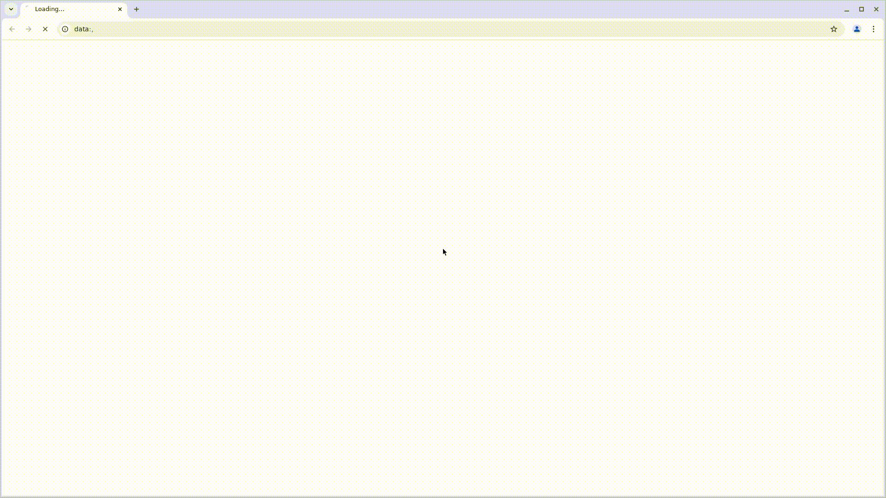

# Проект по автоматизации тестовых сценариев для сайта компании [Корсар](https://korsarcase.ru/)
<a href="https://korsarcase.ru/"></a>

> Корсар - крупнейший российский производитель и постащик профессиональных защитных кейсов и контейнеров
> для транспортировки, эксплуатации и хранения специального оборудования.

## Структура

* <a href="#tools">Стек</a>
* Реализованные проверки
* Запуск из терминала
* Сборка в Jenkins
* Allure отчет
*  Уведомление в Telegram при помощи бота
* Видео примера запуска тестов в Selenoid
---

<a id="tools"></a>
## Стек

<p align="center">  
<a href="https://www.java.com/"></a> 
<a href="https://junit.org/junit5/"></a> 
<a href="https://selenide.org/"></a> 
<a href="https://aerokube.com/selenoid/"></a> 
<a href="https://allurereport.org/"></a>
<a href="https://gradle.org/"></a> 
<a href="https://www.jenkins.io/"></a> 
<a href="https://web.telegram.org/"></a> 
<a href="https://github.com/"></a> 
<a href="https://www.jetbrains.com/idea/"></a> 
</p>

---

## Реализованные проверки
- Проверка работы кнопок и переходов:
  - "Каталог продукции"
  - "Оставить заявку"
  - "Поиск"
  - "Лицензии и сертификаты"
  - "Производство"
  - "Пресс-центр"
  - "Применение"
---

##  Запуск из терминала

Локальный запуск:
```
gradle clean test
```
Удаленный запуск:
```
clean
${TASK}
-Dbrowser=${BROWSER}
-DbrowserVersion=${BROWSER_VERSION}
-DbrowserSize=${BROWSER_SIZE}  
-DremoteUrl=${SELENOID_URL}
```

---

##  Сборка в Jenkins

[Сборка в Jenkins](https://jenkins.autotests.cloud/job/Ready-madeProjectKorsarCase/)



### Параметры сборки в Jenkins:


* `${TASK}`- набор тестов, который будет запущен
  * test - все тесты проекта
  * header_test - тесты на проверку работы хедера
  * menu_test - тесты на проверку работы меню
* `${BROWSER}` и `${BROWSER_VERSION}` - браузер и его версия. По умолчанию - Chrome: 128
* `${BROWSER_SIZE}` - разрешение бразуера. По умолчанию - 1920x1080.
* `${SELENOID_URL}` - адрес удаленного сервера Selenoid.

---

## Allure отчет
[Allure отчет](https://jenkins.autotests.cloud/job/Ready-madeProjectKorsarCase/18/allure/)

* ### Главный экран отчета


* ### Страница с проведенными тестами


Содержание Allure-отчета:
* Шаги теста
* Скриншот страницы на последнем шаге
* Page Source
* Логи браузерной консоли
* Видео выполнения автотеста.

---
##  Уведомление в Telegram при помощи бота



---
##  Примеры видео прохождения тестов
> К каждому тесту в отчете прилагается видео. Одно из таких видео представлено ниже.

